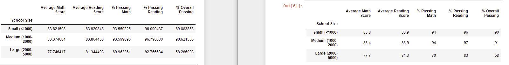

# School_District_Analysis
## Overview of the school district analysis: 

The report aims to sort the data of students in ninth grade within Thomas High School, especially about the math and reading score because people believe it has been changed.

## Results:

- How is the district summary affected?

  The change just makes a little impact on the district summary. It shows a small decrease in those numbers "% Passing Math", "% Passing Reading", "% Overall Passing", between 75, 86, 65 and 74.8, 85.7, 64.9
  

- How is the school summary affected?

  As can be seen from the picture, it shows huge differences in the numbers of these figure "% Passing Math", "% Passing Reading", "% Overall Passing": 83.89, 93.18, 97.01 and 66.91, 69.66, 65.07
  
 

- How does replacing the ninth graders' math and reading scores affect Thomas High School's performance relative to the other schools?

  There are differences between these two. In one table, Thomas High School got high rate as second, while in other one, it's not even ranked in top 5. 
  

- How does replacing the ninth-grade scores affect the following:

1. Math and reading scores by grade

  All the scores and grade for math, reading, or both math and reading scpres are set as NaN for ninth-grade score of students from Thomas High School. So, there is no value in these section.
  All the other students in other grade or schools are not affected.
  

2. Scores by school spending

  There shows no difference after replacing the ninth-grade scores.
  
  
  
3. Score by school size
  
  There is no difference after replacing the ninth-grade scores.
  
  
  
4. Score by school type

  There is basically no difference after replacing the ninth-grade scores
  
  
  
## Summary

There are four significant changes after updating school district analysis which are
- Ranking of Thomas High School 
- "% Passing Math", "% Passing Reading", "% Overall Passing" in district summary
- "% Passing Math", "% Passing Reading", "% Overall Passing" in school summary
- Value of math/reading/math_reading section
